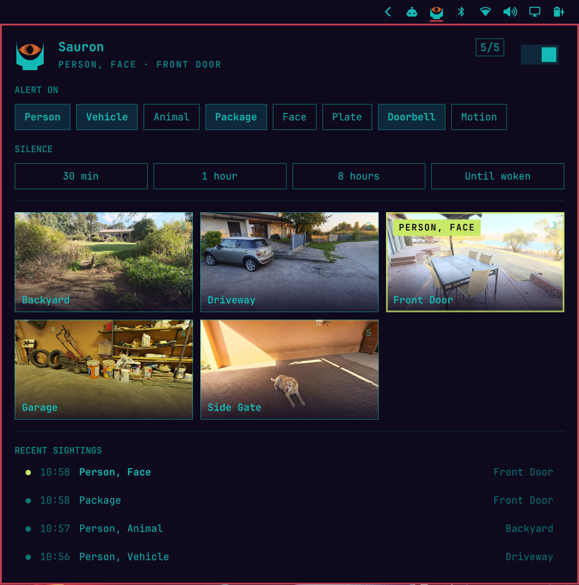
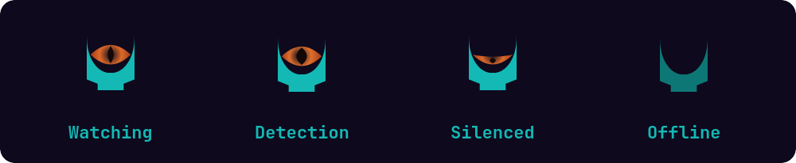
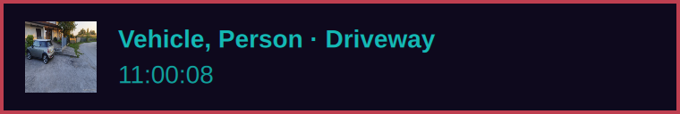
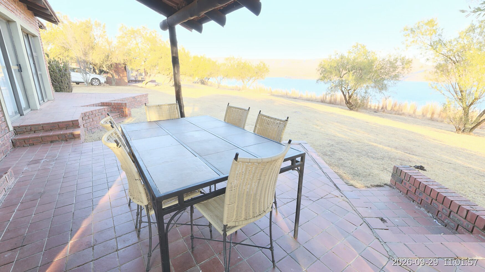

<p align="center">
  
</p>

<h1 align="center">Sauron</h1>

<p align="center">
  An eye in your <a href="https://omarchy.org">Omarchy</a> bar that watches your UniFi Protect cameras.
</p>

<p align="center">
  
</p>

Sauron puts Barad-dûr in your status bar. When a camera sees something you care about (a person, a vehicle, a package, the doorbell), the Eye burns, a notification pops up with a snapshot, and one click opens the camera's live feed.

- **See every camera at a glance.** Click the eye for a grid of snapshots that refreshes every couple of seconds while it's open.
- **Get told what matters.** Pick which detections alert you. Silence the eye for half an hour or until you wake it, and it respects Omarchy's Do Not Disturb.
- **Go live in one click.** Click a camera, a sighting, or a notification to open its live feed in `mpv`. With an optional service account the feed starts almost instantly.
- **Fits your desktop.** The tower, panel, fonts, and colours follow your Omarchy theme, and everything works from the keyboard.
- **Stays on your network.** Sauron talks only to your UniFi console. Nothing goes to the cloud.

## Requirements

- **Omarchy** with its built-in bar (`omarchy-shell`).
- **A UniFi OS console running UniFi Protect 5.3 or newer** (Cloud Key, Dream Machine, NVR, …), reachable from your machine.
- **Rust**, to build the Sauron daemon. If you don't have it, run `omarchy install dev-env rust`.

Everything else Sauron uses (`mpv`, `gum`, GNOME Keyring) ships with Omarchy.

## Install

```bash
omarchy plugin add https://github.com/hassox/omarchy-sauron-protect
~/.config/omarchy/plugins/sauron/install.sh
```

The install script:

1. Builds the daemon.
2. Installs it to `~/.local/bin/sauron`.
3. Puts the eye on the right of your bar.
4. On first install, starts the setup wizard.

To update, run `omarchy plugin update sauron`, then run `install.sh` again so the daemon matches the plugin.

## Set up

Run `sauron setup`, or click the eye and then **Set up**. The wizard asks for three things:

1. **Your console's address.** It suggests your network's gateway, which is usually the console.
2. **A Protect API key.** Create one in UniFi Protect under **Settings › Control Plane › Integrations › Create API Key**.
3. **Instant live video (optional).** See below.

Re-run `sauron setup` any time to change something; your current answers are the defaults. The eye picks up the changes within a few seconds.

### Instant live video (optional)

Without this, live video uses Protect's standard RTSPS stream. That stream can only start at the camera's next keyframe, so a feed takes a few seconds to appear.

The Protect app starts feeds almost instantly with a different stream that needs a UniFi login rather than an API key. To use it, give Sauron a dedicated local account:

1. In UniFi OS, open **Admins & Users** and add a user.
2. Choose **Restrict to local access only**.
3. Give it the **View Only** role for Protect.
4. Leave multi-factor authentication off.

Then enter its username and password in `sauron setup`. The password is stored in your GNOME keyring, not in a file. If that stream ever fails, Sauron falls back to RTSPS.

## Use

| Where | Action | What happens |
|---|---|---|
| Bar eye | Left click | Open or close the panel |
| | Right click | Live feed of the latest detection |
| | Middle click | Silence or wake the eye |
| Panel | Click a camera | Live feed |
| | Right click a camera | Mute or unmute its alerts |
| | Click a sighting | Live feed from that camera |
| | `h` `j` `k` `l` / arrows | Move around |
| | Enter / Space | Activate what's under the cursor |
| | `1`–`9` | Live feed of camera 1–9 |
| | `m` | Mute or unmute the camera under the cursor |
| | `s` | Silence or wake |
| | `r` | Reconnect to Protect |
| | Esc | Close |

<p align="center">
  
</p>

| Eye | Meaning |
|---|---|
| Open | Watching |
| Pupil wide, flames moving | A detection you care about is happening now |
| Pupil wide | You missed sightings; it settles when you open the panel |
| Half closed | Silenced |
| Closed, tower dimmed | Not connected or not set up; open the panel to see why |

### Notifications

<p align="center">
  
</p>

A notification appears as soon as Protect reports a detection you've chosen, and gains a snapshot a moment later. Click it to open that camera live.

- **Silence** (the panel's toggle or silence buttons, a middle click on the eye, or `s`) stops Sauron's notifications for 30 minutes, 1 hour, 8 hours, or until you wake it. Sightings are still listed in the panel.
- **Omarchy's Do Not Disturb** is respected. Sauron's notifications go straight to your notification history instead of popping up, and the eye stays still.

### Live video

<p align="center">
  
</p>

Live feeds open in `mpv`, one window per camera. Opening a camera that's already open brings its window to the front.

### Keybinds and scripts

```bash
sauron setup                      # set up or change the console, API key, and service account
sauron check                      # test the connection and list cameras
sauron cameras                    # list cameras
sauron live "front door"          # open a live feed (camera id, name, or unique prefix)
sauron snapshot driveway          # save a snapshot to ./Driveway.jpg
omarchy-shell sauron toggle       # open or close the panel
omarchy-shell sauron latest       # live feed of the latest detection
omarchy-shell sauron silence 60   # silence for 60 minutes (0 = until woken)
omarchy-shell sauron resume       # wake the eye
omarchy-shell sauron status       # connection status
```

Bind any of these in `~/.config/hypr/bindings.lua`.

## Settings

The panel changes these for you. They're stored in the widget's entry in `~/.config/omarchy/shell.json`, and you can also set them with `omarchy bar set`:

| Setting | Default | Meaning |
|---|---|---|
| `notify` | `["person","vehicle","package","ring"]` | Detections that alert you: `person`, `vehicle`, `animal`, `package`, `face`, `licensePlate`, `ring` (doorbell), `audio` (smoke, CO, siren, glass break, …), `motion` |
| `muted` | `[]` | Camera ids that never alert |
| `desktop` | `true` | Show notifications; `false` keeps alerts to the eye and panel |
| `snapshotIntervalSec` | `2` | How often the grid refreshes while the panel is open |
| `recentSightings` | `5` | How many sightings the panel lists; `0` hides them |

```bash
omarchy bar set sauron notify '["person","ring"]' --json
omarchy bar set sauron recentSightings 10 --json
```

Connection settings live in `~/.config/sauron/config.toml`, which `sauron setup` writes:

```toml
host = "192.168.1.1"      # your UniFi console
api_key = "…"             # or api_key_command = "secret-tool lookup service sauron"
username = "sauron"       # service account for instant live; its password is in your keyring
verify_tls = false        # consoles ship self-signed certificates; set true if yours has a real one
live_quality = "high"     # high | medium | low
player = ["mpv", "--profile=low-latency", "--untimed", "--no-cache", "--force-window=immediate"]
```

## Troubleshooting

- **The eye is closed.** Open the panel. It says what's wrong and offers a button to fix it.
- **Check the connection** with `sauron check`, which prints the Protect version and every camera, or with `omarchy-shell sauron status`.
- **Read the logs** with `journalctl --user -g 'sauron:'`.
- **Live video takes a few seconds to start.** Set up [instant live video](#instant-live-video-optional).
- **Instant live keeps falling back.** Re-run `sauron setup` and re-enter the service account. Sauron pauses its logins for 15 minutes after a rejected password so it can't get the account locked out.

## How it works

```
UniFi Protect ──websockets + REST──▶ sauron watch ──JSON lines──▶ Service.qml ──▶ Panel.qml (bar eye + panel)
                                          │
                                          └──▶ desktop notifications

UniFi Protect ──livestream or RTSPS──▶ sauron live ──▶ mpv
```

- **`sauron watch`** is a small, single-threaded Rust daemon (`daemon/`). It keeps two websockets open to Protect's official Integration API, one for detections and one for camera status, so alerts arrive as soon as Protect reports them. It fetches snapshots only while the panel is open or a detection fires, and sends the notifications.
- **`Service.qml`** runs the daemon inside Omarchy's shell and holds the state.
- **`Panel.qml`** draws the eye and the panel on every monitor.
- **`sauron live`** plays one camera: Protect's livestream when a service account is set up, RTSPS otherwise.

## Development

`daemon/examples/mock_protect.rs` is a fake Protect console. It has five cameras, snapshots, live video, detections on a timer, and a UniFi login. Its API key is `mock`, and its service account is `sauron` with password `mock`.

```bash
cd daemon
cargo run --release --example mock_protect -- --port 7447 --interval 20 --scenes path/to/photos
curl -X POST 'http://127.0.0.1:7447/mock/trigger?camera=Driveway&kind=person'
```

- **Connect to it** with `sauron setup`, using the address `http://127.0.0.1:7447`.
- **Real-looking cameras:** `--scenes` shows `front-door.jpg`, `driveway.jpg`, `backyard.jpg`, `garage.jpg`, and `side-gate.jpg` from that folder instead of test patterns.
- **After editing QML,** run `omarchy restart shell`.
- **After editing the daemon,** run `./install.sh`.

## Credits

- The camera scenes in the screenshots are rendered from [Poly Haven](https://polyhaven.com) panoramas (CC0).
- Sauron is not affiliated with Ubiquiti.
